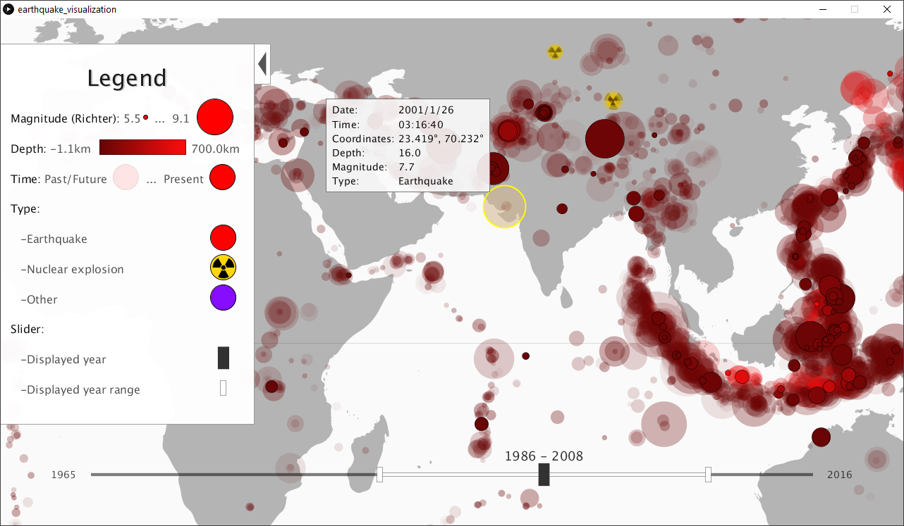

# Earthquake Visualization
A tool for visualizing earthquakes between 1965 and 2016 on the world map.  
Written in [Processing](https://processing.org/).  

## Motivation
What do earthquakes look like if we display all of them at once on a map? Is there a certain pattern?  
Are some locations more susceptible to earthquakes than others? If so, which ones?  
Can we predict where earthquakes are most likely to occur in the future?  

## Findings
Almost all earthquakes occur on the boundaries of tectonic plates.  
A particularly active area is the edge of the Pacific Ocean, also known as the Pacific Rim.  
The visualization makes it very simple to determine whether an earthquake is likely to occur at a given location.  

## Features
* Map navigation through dragging and scrolling
* Earthquake visualization with bubbles of varying attributes
* Displaying earthquake details when hovering over the corresponding bubble
* Displaying earthquakes for a specific year, or for a range of several years
* Togglable legend
* Supports any resolution

## Sources
* [Dataset source](https://www.kaggle.com/usgs/earthquake-database)
* [World map source](https://commons.wikimedia.org/wiki/File:BlankMap-Equirectangular.svg)
